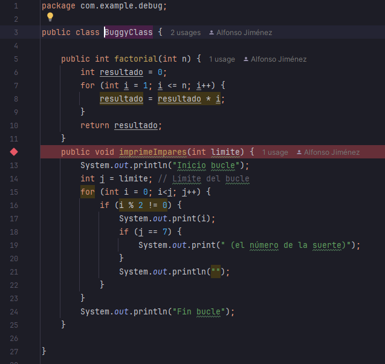
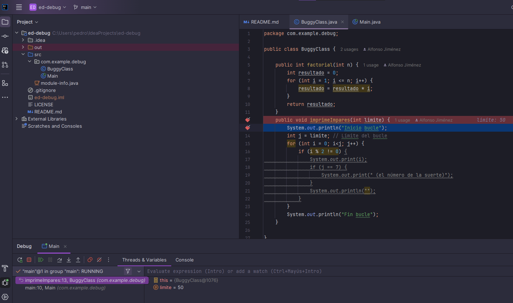

**Debugging (Depuración)**

Para poder depurar un programa, hay que ejecutarlo en *modo debug*, que permite controlarlo paso a paso. Esto se hace con un programa llamado **debugger** o si nuestro IDE lo tiene ya integrado.

### Puntos de ruptura (breakpoints)

Podemos marcar ciertas líneas del código donde queremos que el programa se detenga. Ahí podemos empezar a controlar todo manualmente.

### Opciones comunes al hacer debug:

* **Continuar** hasta el próximo breakpoint o hasta que termine el programa.
* **Paso a paso (step over):** Ejecuta la línea actual y pasa a la siguiente.
* **Entrar (step into):** Entra en el detalle de la función o instrucción actual.
* **Salir (step out):** Termina de ejecutar la función en la que entramos y vuelve al nivel anterior.
* **Finalizar:** Detiene la ejecución del programa.

### Análisis de variables

Podemos:

* Ver el valor de cualquier variable en ese momento.
* Escribir expresiones y ver su resultado.
* Fijar variables o expresiones para ir viendo cómo cambian durante la ejecución.

# Ejemplo debug

