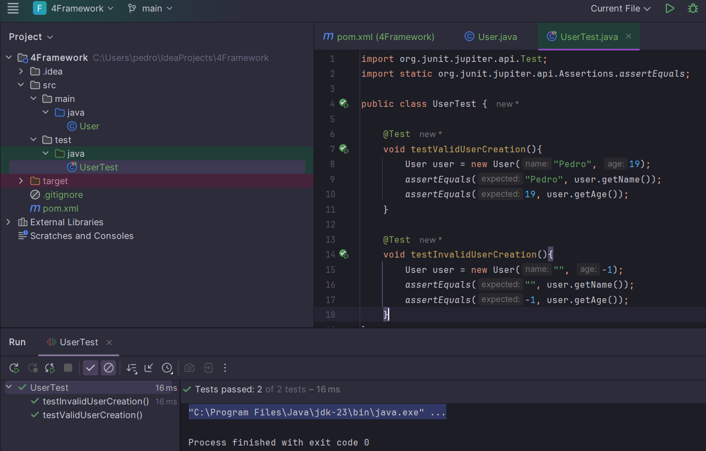
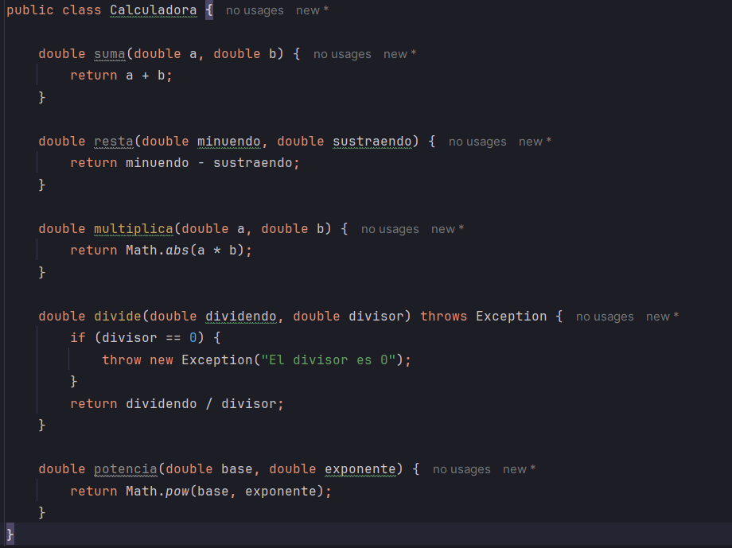
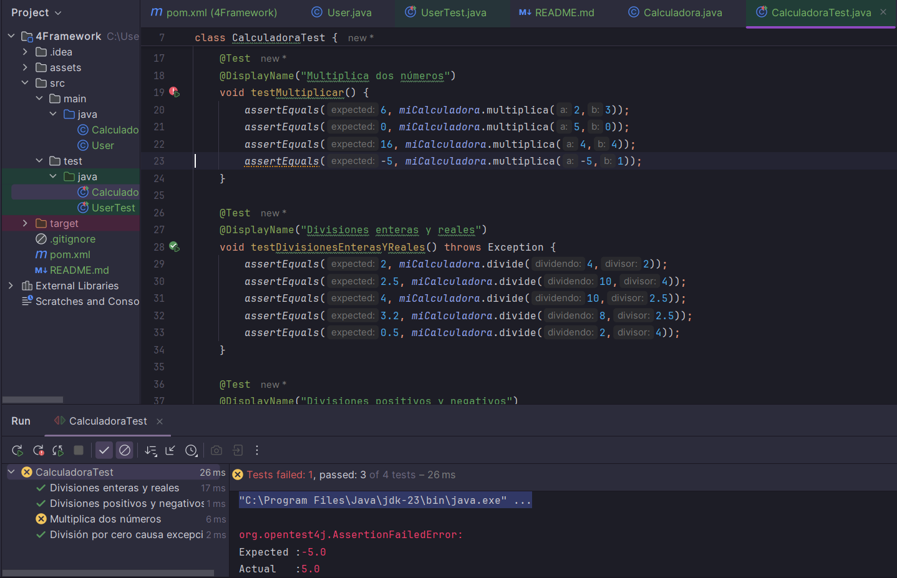
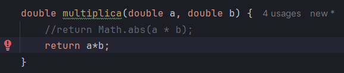
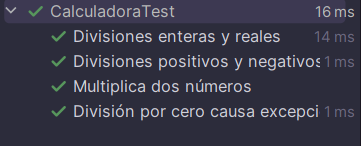
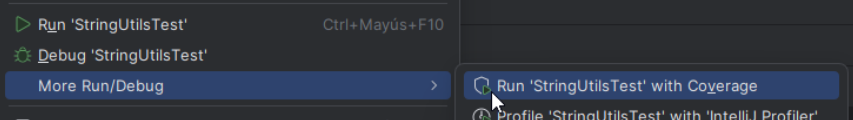
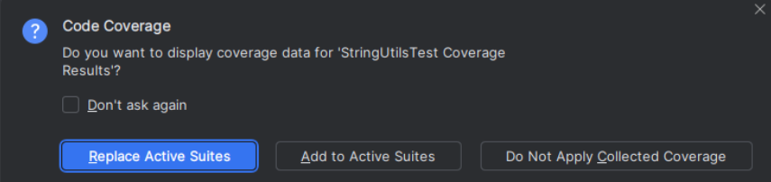
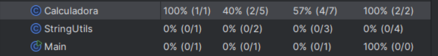

# Testing basico

He creado una clase User con sus atributos, despues he creado un UserTest para probarla

# Testing algo mas complejo

He creado la clase calculadora

Y luego la clase CalculadoraTest que detecta un error

error corregido

## Covertura de codigo

La cobertura de código permite analizar qué líneas de código se ejecutaron durante un test específico. Ayuda a determinar que porcentaje de código se ha cubierto por las pruebas e identificar áreas con una cobertura de prueba insuficiente.

