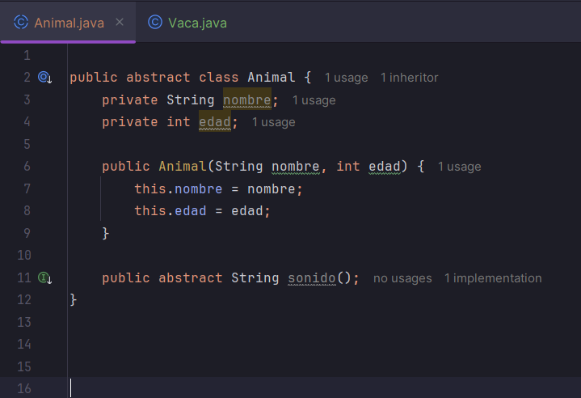
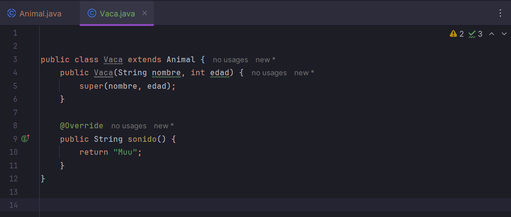
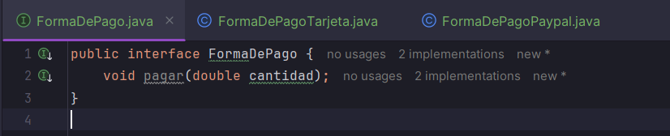
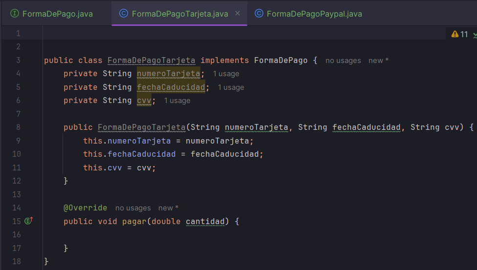
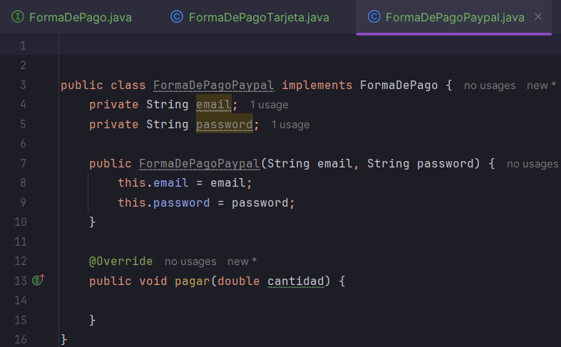
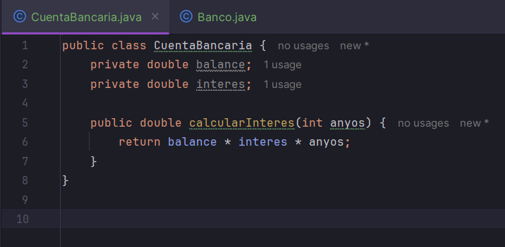
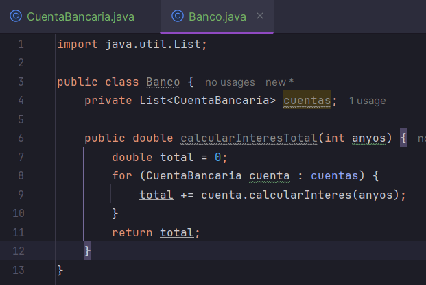
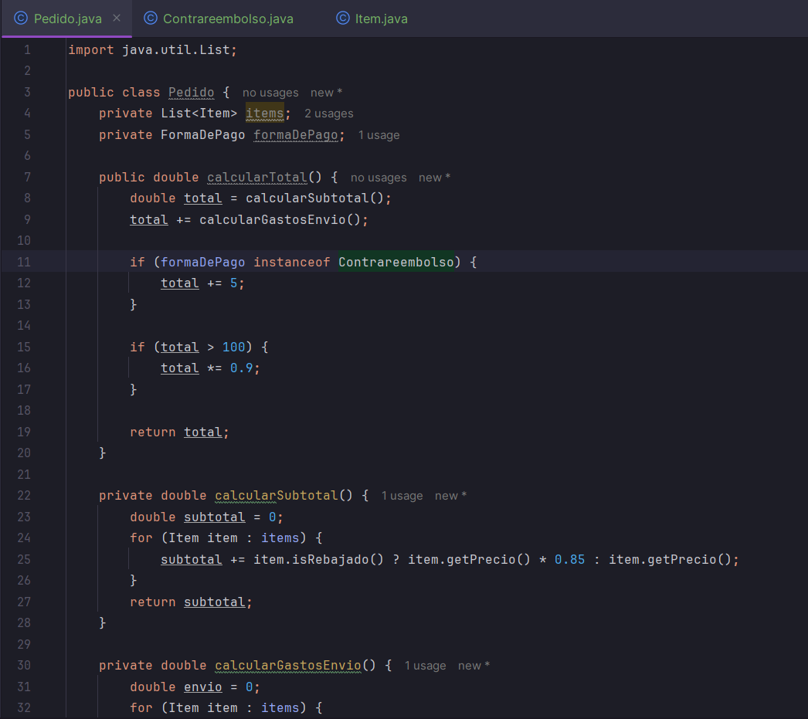
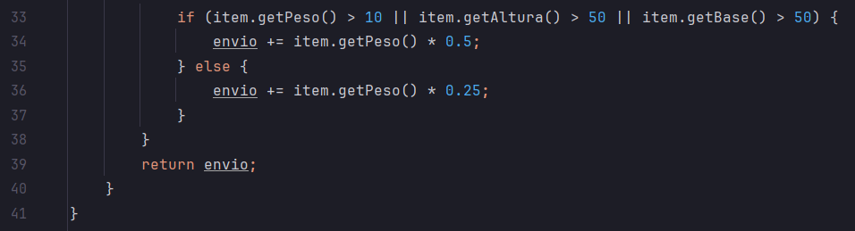

## Actividad 6.1 – Code Smells y Refactorización

### Clase `Animal`

#### **Code Smells detectados**:

* Método estático depende de instancia (`tipo`): `tipo` es un atributo de instancia, pero se usa en un método `static`.
* **`switch` o `if` largo (Code Smell: *Large Conditional*)**
* **Falta de polimorfismo (Code Smell: *Type Checking*)**
* **Variable no declarada (`resultado`)**

#### Refactorización :

* crear una jerarquía para cada tipo de animal.
* Eliminar uso de condicionales.
* Eliminar método estático.
* 

### Clases `FormaDePagoTarjeta` y `FormaDePagoPaypal`

#### **Code Smells detectados**:

* **Duplicación de lógica de pagos (Code Smell: *Duplicated Code*)**
* **Falta de abstracción común (Code Smell: *Speculative Generality*)**

### Refactorización

* Crear una **interfaz común**`FormaDePago`.
* Unificar nombres de métodos (`usar` y `hacerPago`).

### `CuentaBancaria` y `Banco`

### **Code Smells detectados**:

* Falta de encapsulamiento de lógica (Code Smell: *Feature Envy*):`Banco` calcula intereses con lógica que debería estar en `CuentaBancaria`.

### Refactorización:

* Mover la lógica del cálculo del interés a `CuentaBancaria`.

### Clase `Pedido`

#### **Code Smells detectados**:

* **Método muy largo (Code Smell: *Long Method*)**
* **Demasiadas responsabilidades (Code Smell: *God Class*)**
* **Nombres ambiguos (`formaDePago` como `String` en lugar de objeto)**
* **Duplicación de lógica de descuento y gastos de envío**

#### Refactorización propuesta:

* Extraer métodos para calcular descuentos, gastos de envío, etc.
* Usar clase para `FormaDePago`.
* Posiblemente aplicar **Patrón Strategy**.

#### Código refactorizado (fragmento):

